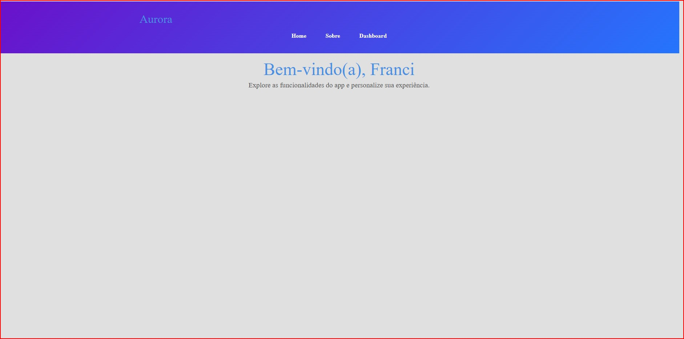

# Projeto 13 - Aurora Dashboard

[Tela do Projeto - Aurora Dashboard](src/assets/images/dashboard.jpg)
[Tela do Projeto - Aurora sobre](src/assets/images/sobre.jpg)

Este projeto foi desenvolvido como parte da **Entrega 1** do curso Desenvolvimento Front-End com React - iTalents.

## Descrição
O **Aurora Dashboard** é um painel interativo que demonstra conceitos de React, como componentes, props, children e gerenciamento de estado com useState.  
O projeto permite que o usuário selecione temas diferentes e visualize mensagens, mantendo um layout responsivo e moderno.

## Tecnologias Usadas
- React
- React Router DOM
- CSS: 

## Funcionalidades
- **Header**: Componente que utiliza `children` para título e subtítulo. Ocupa toda a largura da tela.
- **Message**: Componente que recebe props para exibir mensagens dinâmicas.
- **ThemeSelector**: Componente interativo que altera o tema da área principal usando useState.  
  - Temas disponíveis: Claro, Escuro e Azul Claro (#00bcd4)
- Layout responsivo e elegante.
- Sem scroll horizontal, garantindo melhor experiência de usuário.
- Home: Página inicial, com possibilidade de exibir o nome do usuário via parâmetro de rota (/:username).
- About / Sobre: Página explicativa do funcionamento do app.
- Dashboard: Área principal com ThemeSelector.
- NotFound (404): Página de erro para rotas inexistentes.

# Passos para execução local
1. Clonar o repositório:  
git clone 

2. Acessar a pasta do projeto:
cd pet-catalog

3. Instalar as dependências:
npm install 

4. Rodar a aplicação React 
npm start

5. Abrir no navegador:
http://localhost:3000
http://localhost:3000/user/seunome

6. Para ver a página 404:
   http://localhost:3000/rota-inexistente