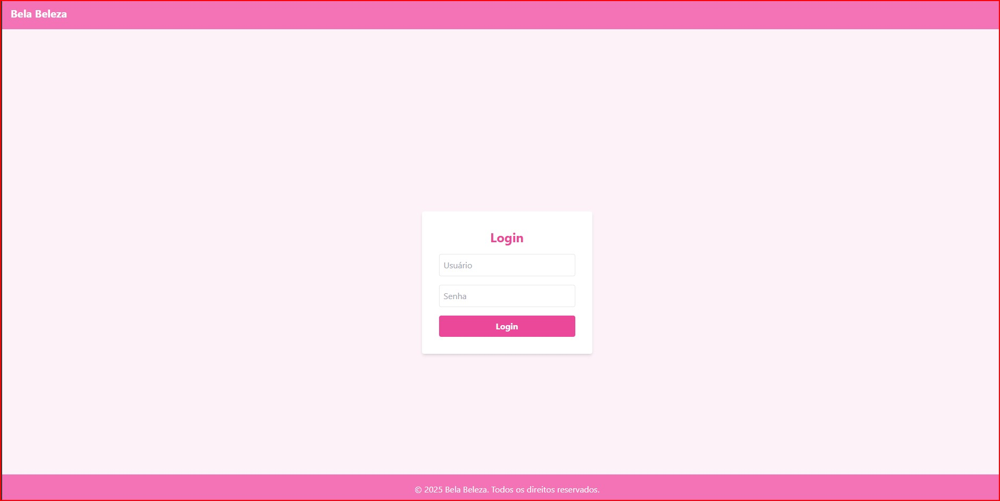
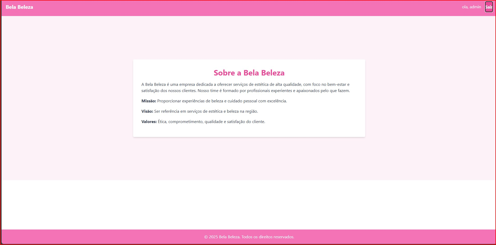
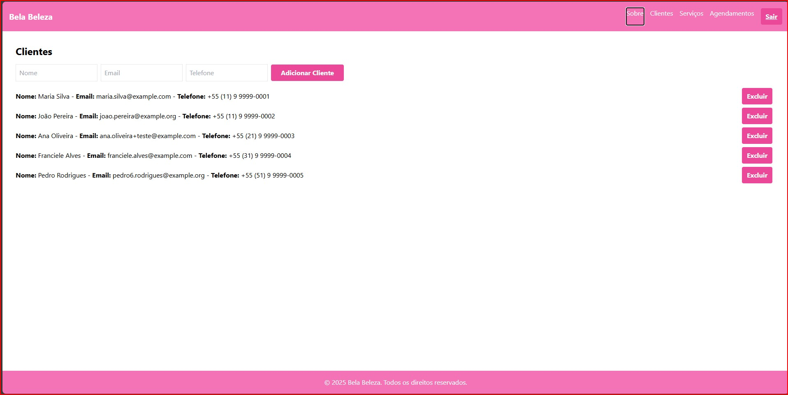
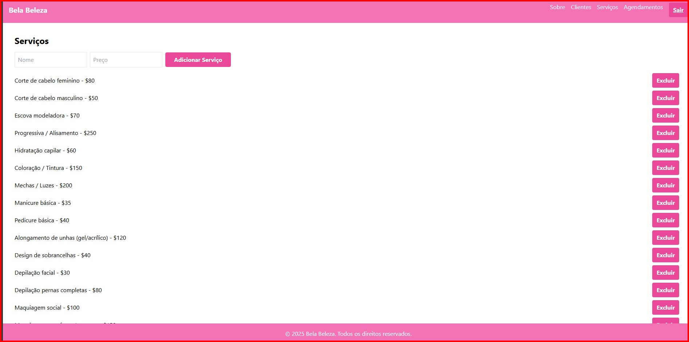
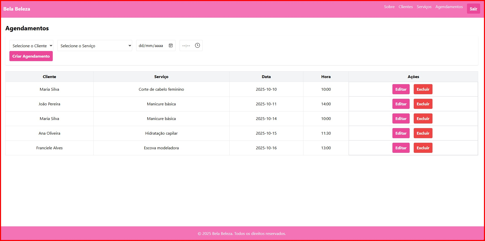

# Projeto 16 - Bela Beleza
### Login

### Sobre

### Clientes

### Serviços

### Agendamentos

Este projeto foi desenvolvido como parte da **Entrega final** do curso Desenvolvimento Front-End com React - iTalents.

## Descrição
O **Bela Beleza** é um sistema de demonstração para gerenciamento de uma empresa de beleza, com foco em autenticação e visualização de informações da empresa.  

O projeto utiliza React, Context API para autenticação, Tailwind CSS para estilização e uma API simulada via JSON Server.

O layout é responsivo, com Header e Footer fixos e área principal centralizada, garantindo uma experiência visual limpa e moderna.

## Tecnologias Usadas
   - React.js  
   - Tailwind CSS  
   - React Router DOM  
   - Axios  
   - JSON Server  
   - useContext  
  
## Funcionalidades
### Login
- Autenticação de usuário
- Redireciona para Dashboard após login

### Dashboard
- Página inicial com resumo dos dados

### ClientsPage
- CRUD completo de clientes
- Busca clientes da API (`GET /clients`)
- Loading rosa enquanto os dados carregam

### ServicesPage
- CRUD completo de serviços
- Busca serviços da API (`GET /services`)
- Loading rosa durante carregamento

### Appointments
- CRUD completo de agendamentos
- Busca agendamentos, clientes e serviços (`GET /appointments`, `/clients`, `/services`)
- Loading rosa enquanto carrega

# Passos para execução local
1. Clonar o repositório:  
git clone 

2. Acessar a pasta do projeto:
cd bela-beleza

3. Instalar as dependências:
npm install 

4. Rodar a aplicação React 
npm start

5. Rodar o JSON Server (em um terminal) 
npm run server
A API será iniciada em: http://localhost:3001/users

6. Rodar a aplicação React (em outro terminal)
npm start

7. Abrir no navegador
http://localhost:3000:

# Credenciais para teste

Para acessar a aplicação, use os seguintes dados:

Usuário: admin

Senha: 1234

Se qualquer outro usuário/senha for utilizado, será exibida a mensagem de erro: "Usuário ou senha inválidos".