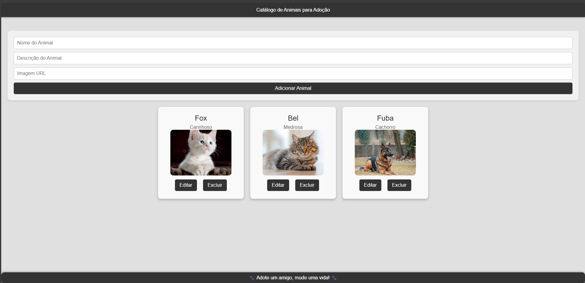

# pet-catalog

Este projeto foi desenvolvido como parte da Entrega 4 do curso Desenvolvimento Front-End com React - iTalents.

# Descrição
Este projeto é um catálogo interativo de animais disponíveis para adoção. Os usuários podem visualizar informações sobre os animais, editar detalhes e removê-los da lista. O projeto utiliza React e JSON Server para simular uma API.

## Tecnologias Usadas
- React: Biblioteca JavaScript para construção de interfaces de usuário.
- JSON Server: Ferramenta para criar uma API RESTful com um arquivo JSON.
- CSS: Estilização visual do projeto.

## Funcionalidades

- Adicionar novos animais com nome, descrição e link da imagem.
- Exibir a lista de animais cadastrados.
- Editar informações de animais existentes.
- Remover animais da lista.
- Mensagem de erro quando falha na comunicação com a API.
-Indicador de carregamento enquanto os dados são buscados.
- Layout responsivo, exibindo os cards lado a lado.

## Tecnologias utilizadas
- React

# Passos para execução local
1. Clonar o repositório:  
git clone 

2. Acessar a pasta do projeto:
cd pet-catalog

3. Instalar as dependências:
npm install 

4. Rodar o JSON Server (em um terminal) 
npm run server
A API será iniciada em: http://localhost:5000/animals

5. Rodar a aplicação React (em outro terminal)
npm start

6. Abrir no navegador
http://localhost:3000:
