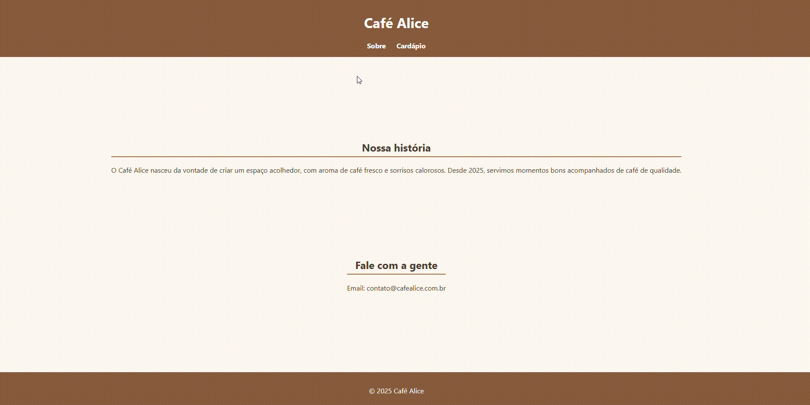

# Projeto 02 - Site da Cafeteria Fictícia "Café Alice"

Este projeto foi desenvolvido como parte da **Entrega 2** do curso [Desenvolvimento Front-End com React - iTalents](https://italents.com.br).

## Descrição

O objetivo da atividade foi criar uma estrutura completa utilizando **HTML5 com semântica**.
O site fictício "Café Alice" possui duas páginas:

- Página "Sobre" com a **história da cafeteria** e um **contato fictício**.

## Conceitos aplicados

- Uso de tags semânticas: `<header>`, `<main>`, `<section>`, `<footer>`, etc.
- Duas páginas HTML conectadas via `<nav>` com links.
- Flexbox para centralização do conteúdo.
- CSS transitions para efeitos suaves em botões e links.
- Manipulação do DOM via JavaScript para interações dinâmicas.

# Estilização aplicada

Paleta de cores quentes e aconchegantes, remetendo a café

Tipografia Segoe UI para leitura agradável

Layout centralizado com Flexbox/Grid

Navegação estilizada com hover e transições suaves

Botões com efeito de destaque ao passar o mouse

Footer padronizado

Responsividade básica para telas menores

## Funcionalidades implementadas

- Botão que exibe **promoções aleatórias** com efeito de fade usando JavaScript.
- Mensagem dinâmica que atualiza ao clicar no botão.
- Links do menu com **efeitos hover, focus e active** para melhorar a usabilidade.
- Layout centralizado do conteúdo principal (`main`) respeitando **header e footer**.
- Responsividade completa para telas menores.

##  Tecnologias utilizadas

- HTML5
- css
- JavaScript (ES6)

